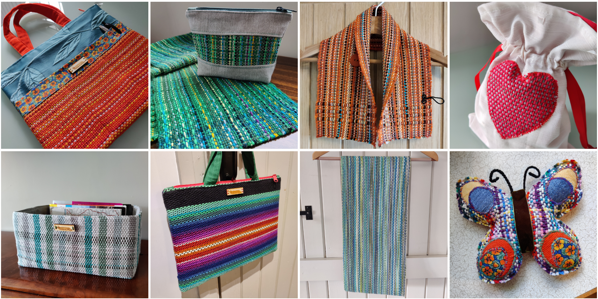
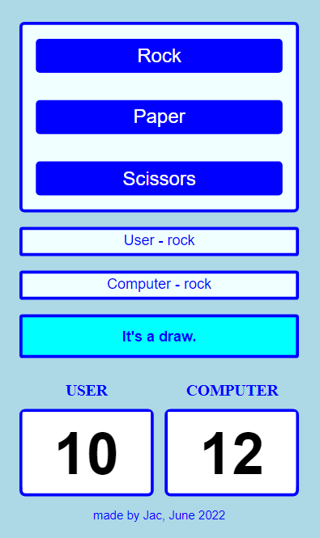

# pre-Academy-work

These are examples of self-directed practice projects I worked on while acquiring skills in HTML, CSS, and JavaScript before and after my Code First Girls Introduction to Web Development course.

## [Image Gallery](https://github.com/Jacamy/pre-Academy-work/tree/main/image-gallery)

This is a responsive flex gallery.

## [Rock Paper Scissors](https://github.com/JacDoesJS/pre-Academy-work/tree/main/rock-paper-scissors)

This is a rock, paper, scissors game, which takes the user's name and keeps score while they play against the computer. Following on from a brief introduction to querying the DOM on my my Code First Girls Introduction to Web Development course, I learned more about it online and was delighted to move on from relying on alert boxes. 

## [Weaving Inspiration](https://github.com/Jacamy/pre-Academy-work/tree/main/weaving-inspiration)

I wanted to experiment more with flex so I made this. These are three of the weavers whose work has inspired me the most. Theo Rooden in particular has an amazing eye for beautiful design.  
 
 
The below are some earlier practice attempts.

## [Exercise](https://github.com/JacDoesJS/pre-Academy-work/tree/main/exercise)

## [website test](https://github.com/JacDoesJS/pre-Academy-work/tree/main/website-test)
